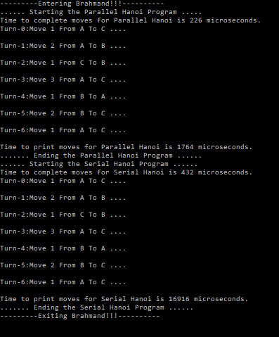

# Brahmand
Parallelizing the Serial Version of the Towers Of Hanoi Puzzle using Open MP Library in VC++

## What is Brahmand anyways?
'Brahmand' in Sanskrit, means the Universe created by the Lord Brahma, who is the creator amongst the Gods in the Trinity of the Hindu Mythology.

## Why is this Solution called 'Brahmand', by the way?
It is called so because of the Towers of Brahma, after the ancient myth of the Puzzle or Game that is played by the mystical beings, believed to be present in the ruins, hidden in the chasms of the temple of Kashi Vishwanath!

## What are the Towers of Brahma, anyways?
They are the more sophisticated Version of the famous Puzzle known to everyone as the 'Towers of Hanoi'! Coined by the famous French Mathematician, Edouard Lucas (1883 A.D).

## So, now What are the 'Towers of Hanoi'?
In Simple Terms, it is a fascinating Game or Puzzle.
Which is described as follows:
1. There are N Disks given to You.
2. There are 3 Towers or Pegs A, B, C.
3. Your Job is to move all the Disks from A -> C.
But with a twist or constraint ....
1. The Disks 1..N are stacked in a specific order such that the Bigger Disks at the Bottom with Higher Number (Value) or Diameter as you may assume, may not be broken!
2. That means that Only a Smaller Disk can lie over the larger one!
3. You cannot move or place or put a Larger Disk over a smaller one!
That's It!

## Hmm ... How do I play this?
1. Your Job is to move the N Disks from A -> C respecting the rule or constraint mentioned above.
2. You may use B as the Auxiliary Disk in case you can't directly place one of the Disks over the other and you have run out of Towers or Pegs.

## Got it! But, what's the objective of this Game or Puzzle?
Your task is to list down each sequence or series of moves & also compute the total number of moves in order to achieve the task given N Disks & the Towers A, B & C!

## I'm baffled! How do I go about solving this?
It's pretty simple....
Here's how ...
1. Imagine N = 1, In this case you move Disk-1 from A -> C directly!
2. Imagine now N =2, Now move Disk-1 from A -> B, and subsequently, Disk-2 from A -> C. Then finally move Disk-1 from B -> C!
3. What if N = 3? Simple repeat the same procedure ....
   Disk-1 from A -> C.
   Disk-2 from A -> B.
   Disk-1 from C -> B.
   Disk-3 from A -> C.
   Disk-1 from B -> A.
   Disk-2 from B -> C.
   Disk-1 from A -> C.
   That's It!
4. What if N = 4? Read on ..!!

## N = 4? Am I missing something?
Do you see a pattern from the discussion mentioned above?

## Ah Yes! I see how the steps are repeating.... right?
That's absolutely right!
In Computers it is called Recursion!

## What is this Recursion?
The same task is repeated over and over again but with different inputs!
The Complex or tough or sophisticated Task is broken down into recurring smaller simpler ones!
The procedure is the same for each smaller sub-task!
There's how you can break down even such a complex or complicated task into simpler ones!

## This is Geeky Stuff like Math ... !!!
Correct!
And this thing called Recursion is captured using equations called Recurrence Relations!

## To Elucidate .... where else is this Recursion used?
In Fibonacci Sequences, Sum of n numbers, DFS (Depth First Search), BFS (Breadth First Search), Tree Traversals and more...!!!

## Okay I Get It! Now how does that help?
The Recursion can be visualized as a Binary Decision Tree!

## What does that mean?
It simply means that you can have a fork in each path at every node in the Tree!
This brings us to an excellent candidate for Parallelism!
But first, we must understand Divide & Conquer .....

## OMG! Divide & Conquer .....?
Yes! It simply means that break down a very complicated & sophisticated problem into smaller bits or pieces (parts) and attack them individually in parallel!
The Merge-Sort is an excellent example of this!
We can decompose a huge data set into smaller sized chunks or pieces and attain high degree of Parallelism for it!

## Any Practical Examples of this?
Google's Map-Reduce works on this paradigm to do number crunching by creating master - slave (worker nodes) in the Map step & then aggregating them back in the reduce step!

Yes, the Word Count Problem from a huge Corpus is such an example that is dealt with practically using the above philosophy!

## Okay ... back to Parallelism, how do we achieve it?
We use simple pragma directives in code to mark or demarcate the chunks or sections of code that should or can run in parallel using the OpenMP Library!

## How does that help?
Each sub-tree in the Binary Tree is worked upon by the  threads in parallel! Then after the recursion is over they are collated and put into a map!

## Hmmm where's the Result stored?
In a map like mentioned above with the step number as the key & the move description as the value!

## That's beautiful! But what is OpenMP now?
It is an API for Multiplatform Shared Memory Multi-Processing Library in C++ esp. and other platforms and languages!

## That clarifies a lot of things now! But coming back whole circle .... why Brahmand?
Simple as it may sound ... it is believed that after every 10,000 years the world comes to an end and the whole cycle is repeated again ... and so on ...!!
This is precisely the time or the number of turns taken to complete the Towers of Brahma Puzzle!!!
But the rest is History and the Myth is a Mystery!!!

## Wow! Now I realize how seemingly disparate things on the surface are interconnected from deep within ... !!!
Yup! To understand the cycle is a thing ... but to program it is another!!!

## That's makes stuff Crystal Clear now ... What Next?  
The Only way to break free is to use whatever power you have at your finger tips!!!

So, with that I would like to close this Discussion ....
On a Closing Note ..... to Get You Started ....

## To Get You Upto Speed and Running .....

## Closing Notes ....
That's All Folks!
So Feel free to go through the code & bring your creative side to the rescue!
With that ...  
Happy Coding!!  

:-)

Best Regards,  
Bhaskar Rao.
